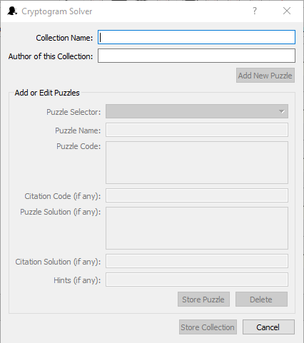

Adding and Editing Puzzles in a Collection
==========================================

The bottom part of the Add/Edit Collection dialog box is used for entering puzzles into the collection, editing
puzzles already in the collection or deleting puzzles from the collection.  When creating a new collection this
part of the dialog box is active after you have entered the Collection Name and pressed the Add New Puzzle
button.  When editing an existing collection this part of the dialog box is active and set to the current puzzle in the
main program when you first enter the dialog and as long as the Collection Name box contains a valid collection name.

The following chart outlines the use of the dialog box:

+------------------------+---------------------------------------------------------------------+
| Puzzle Selector        | This combo box contains the names of existing puzzles, if any, and  |
|                        | can be used to select a puzzle to work on.  When adding a new       |
|                        | puzzle this is blank until the Store Puzzle button is pressed.      |
+------------------------+---------------------------------------------------------------------+
| Puzzle Name            | Type the desired name of the puzzle into this box or keep the       |
|                        | default which is Puzzle n, where n is the next number in the        |
|                        | sequence of puzzles.  Every puzzle must have a name so if this      |
|                        | box is blank, none of the rest of the controls will be activated    |
+------------------------+---------------------------------------------------------------------+
| Puzzle Code            | Type the cryptogram itself into this box.  The characters you type  |
|                        | will automatically be converted to upper case.  Every puzzle must   |
|                        | have a code so if this box is blank, none of the rest of the        |
|                        | controls will be activated.                                         |
+------------------------+---------------------------------------------------------------------+
| Citation Code (if any) | If the puzzle is a quote from a particular source, and the          |
|                        | citation is part of the puzzle, type its code here.  It needs to    |
|                        | to follow the same key as the puzzle code.  In other words, if A=K  |
|                        | in the main puzzle, A=K in the citation code too.                   |
+------------------------+---------------------------------------------------------------------+
| Puzzle Solution        | Type the solution to the puzzle in this box.  The characters you    |
| (if any)               | type will automatically be converted to upper case.  If you want to |
|                        | use Cryptogram Solver to find the solution yourself, you may leave  |
|                        | this blank for now and save the solution after solving it by        |
|                        | clicking "Save Solution" on the Admin menu.                         |
+------------------------+---------------------------------------------------------------------+
| Citation Solution      | Type the citation, if any, as to the source of this puzzle in this  |
| (if any)               | box.  As with the puzzle solution, you may leave this blank and     |
|                        | save it later by using Cryptogram Solver to solve the puzzle        |
|                        | yourself and then clicking "Save Solution" on the Admin menu.       |
+------------------------+---------------------------------------------------------------------+
| Hints (if any)         | Some cryptogram books come with hints as to the solutions of the    |
|                        | puzzles.  These hints, if any, can be entered here separated by     |
|                        | semicolons.  For example, if you enter **A=K; B=Q** into the box,   |
|                        | the first hint given when the user clicks "Get Hint" on the puzzle  |
|                        | menu is that A=K.  That is, all appearances of the letter A in the  |
|                        | puzzle code will have the solution slots above them replaced with   |
|                        | the letter K.  If the user clicks "Get Hint" again, the letter Q    |
|                        | will be filled in above all occurences of the letter B.  This will  |
|                        | continue for as long as there are hints remaining.                  |
+------------------------+---------------------------------------------------------------------+
| Clear                  | Press this button to clear all of the Add or Edit Puzzle controls.  |
|                        | This provides a quicker means of erasing extensive mistakes.        |
+------------------------+---------------------------------------------------------------------+
| Store Puzzle           | Once you have entered at least the Puzzle Name and Puzzle Code,     |
|                        | this button will be activated and you can click it to save the      |
|                        | puzzle.  If this is a new puzzle you are adding to the collection,  |
|                        | it's name will be added to the Puzzle Selector.  To continue adding |
|                        | puzzles you can click "Add New Puzzle."                             |
+------------------------+---------------------------------------------------------------------+
| Delete                 | If you want to delete the puzzle currently listed in the Puzzle     |
|                        | Selector box, click this button.  You will be asked to confirm the  |
|                        | deletion.  If you do, the puzzle will be deleted from the           |
|                        | collection which cannot be undone.  If this puzzle was selected in  |
|                        | the main program, the main program's current puzzle will be changed |
|                        | to the next one, if possible, or the previous one if this was the   |
|                        | last.                                                               |
+------------------------+---------------------------------------------------------------------+

