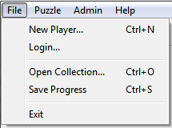

The File Menu
=============

The file menu makes available some of the fundamental elements of using the Cryptogram Solver program:  registering and
identifying the current player, selecting the set of puzzles to be solved and exiting the program.

New Player...
-------------

Login...
--------

Open Collection...
------------------

Save Progress
-------------

Exit
----
